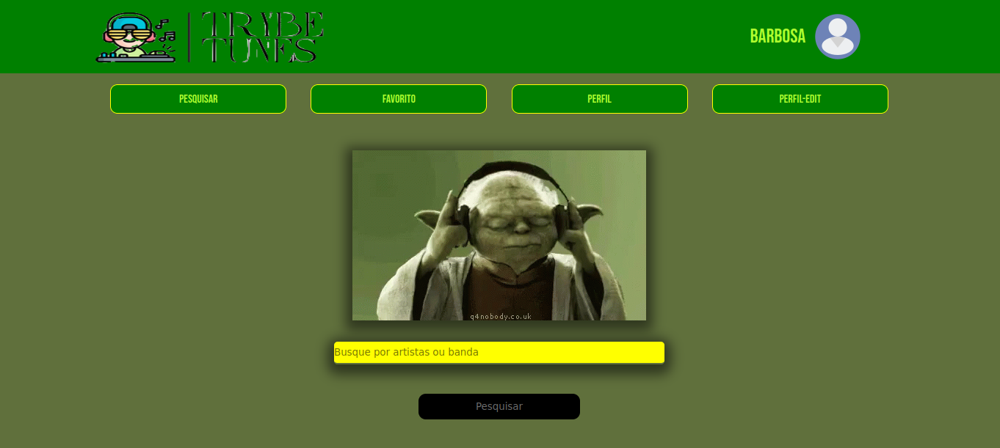

# Trybe-Tunes

<<<<<<<<<< OBS: Em desenvolvimento >>>>>>>>>>

## Objetivo

Criar uma aplicação capaz de reproduzir músicas das mais variadas bandas e artistas, criar uma lista de músicas favoritas e editar o perfil da pessoa usuária logada. 

## Requisitos
    1- Fazer login;
    2- Pesquisar por uma banda ou artista;
    3- Listar os álbuns disponíveis dessa banda ou artista;
    4- Visualizar as músicas de um álbum selecionado;
    5- Reproduzir uma prévia das músicas deste álbum;
    6- Favoritar e desfavoritar músicas;
    7- Ver a lista de músicas favoritas;
    8- Ver o perfil da pessoa logada;
    9- Editar o perfil da pessoa logada;

## Imagens do projeto

#### Tela de login

#### Tela de pesquisa

